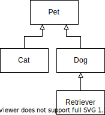
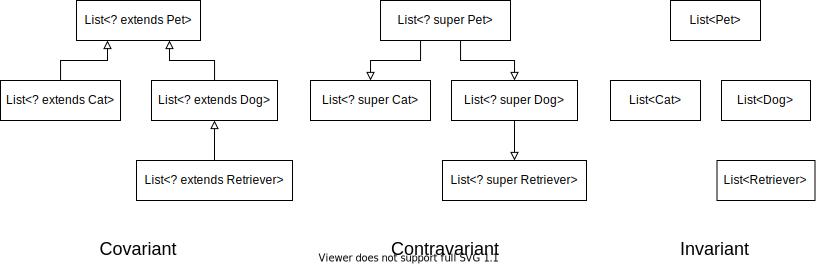

## Prerequisites

In the following we are going to talk a lot about subtypeing relations. 
The following simple inherence hierarchy introduces a common basis that we will refer back to.



Both `Cat` and `Dog` have the common super type `Pet`. In other words, they both extend `Pet` and are subtypes of `Pet`. `Retriever` is a special kind of `Dog` and therefore also a `Pet`.

All the above types are *simple types* in the sense that they stand for them self. They do not depend on any other type.
This is opposed to *complex types* (also known as /generic types or parametric types) like `List<T>`. They depend on other types. In the case of `List<T>` `T` can be any other type (simple or complex).

## Variance

Subtyping of simple types is relative straight forward and intuitive for most programmers. It is usually explained with sentences like: "Every `Dog` is a `Pet`, but not every `Pet` is a `Dog`".
In the following we are interested how the subtypeing relation extends to complex types. 

So is every `List<Dog>` also a `List<Pet>` or might the reverse be true? The underwhelming answer is: It depends...
To be more precise, it depends on the *variance* of the complex type.
Given a complex type `C<T>` with a single type parameter `T`. `C<T1>` is a subtype of `C<T2>` when `C` is
 - **Covariant** only if `T1` is a subtype of `T2`. This is the intuitive case. For the "outer" type to be subtype the "inner" type must also be a subtype. In Java, a complex type is marked as covariant with the `? extends T` wildcard e.g. `List<? extends T>`.
 - **Contravariant** only if `T2` is a subtype of `T1` or equivalently `T1` is a supertype of `T2`. This might seem counterintuitive. Here the relation of the "inner" is reversed. In Java, a complex type is marked as contravariant with the `? super T` wildcard e.g. `List<? super T>`.
 - **Invariant** only if `T1 = T2`. Invariant means that the type is neither covariant nor contravariant. In Java, by default all complex types are invariant (i.e. `List<T>` is invariant).

The following graphic depicts how covariant, contravariant and invariant `List`s relate to each other.



In the covariant case, the type hierarchy is preserved. If the type is contravariant the relation is inverted (notice the flipped arrows). No hierarchy exists, if the type is invariant.

### Which variance is correct?

Correct use of variance makes types more flexible and hence more useful.
In general, if a type only produces values of `T` it should be covariant. The produced value could be more specific. The caller only needs the guarantee that the value supports at a minimum all operations of `T`.

On the other hand, if a type only consumes values of `T` it should be contravariant. The caller only needs the guarantee that values of type `T` can be passed to the consumer. The consumer implementation could be less picky and find with more general values.

If a type both produces values of type `T` and consumes values of type `T` i.e. is both a consumer and a producer of `T`. In some situation it needs to be more general and in others more specific. Hence, we are constraint to exactly `T`.
In this case, we do not get any extra flexibility as the type must be invariant.

[This Stack Overflow answer](https://stackoverflow.com/a/48858344) summarizes producer and consumers with a nice comic.

For sake of simplicity we skipped over the detail that a complex type can have arbitrarily many type variables. Variance is separately specified for each type variable. For example, using the above guidelines we get that a function should be contravariant in its argument types and covariant in its return type.
In java it is therefore common to see mouthfuls like `Function<? super TInput, ? extends TOutput>`.

### Variance in Java
In Java variance is handled with wildcards when the type is used. 
In some sense, when defining the complex type `C<T>` with the single type variable `T` actually creates three type constructors, namely `C<? extends T>`, `C<? super T>` and `C<T>`. The user of the type then has to decide on every use which version is appropriate.
In general, for a type with `n` type variables there are `3^n` versions (all combinations of all variances for all type variables).

Taking our knowledge we can write a method that copies the elements from one list (`source`) to another (`destination`).
In this context, `source` is clearly a producer and `destination` a consumer.

```java
static <T> void copy(List<? super T> destination, List<? extends T> source) {
    for (T el: source) {
        destination.add(el);
    }
}
```
Note: In practice, please use `addAll`, also either one of the wildcards would suffice. This is just an example.

As we expect we can copy a list of cats into a list of animals.
```java
List<Cat> cats = ...;
List<Pet> pets = new ArrayList<>();
copy(pets, cats);
```

An interesting aspect is how the Java type checker reasons about such method calls.
From the view of the compiler wildcards are "anonymous" type variables. They are created in a process called [Capture conversion](https://docs.oracle.com/javase/specs/jls/se8/html/jls-5.html#jls-5.1.10). We will use lowercase letters to distinguish the type variables used by the compiler from the type variables on the source code level.

Reasoning about the above `copy` call, the type checker starts off with the following set of type variables `{t extends Object, a super t, b extends t}`.
The type variable `t` comes from the type variable `T` declared by the method. As it has no bound it gets the default bound `Object`. The other two variables (`a`, `b`) are produced by capture conversion (replacing `?` with a fresh type variable).
Additionally, the parameter list effectively becomes `(List<a> destination, List<b> source)`.
By matching against the type of the arguments, it is deduced that `a = Pet, b = Pet`.
Putting it all together and simplifying we are left with `{Pet super t, Cat extends t}`.
This equation system has two solutions. Both `t = Pet` and `t = Cat` work.

### Variance in Kotlin